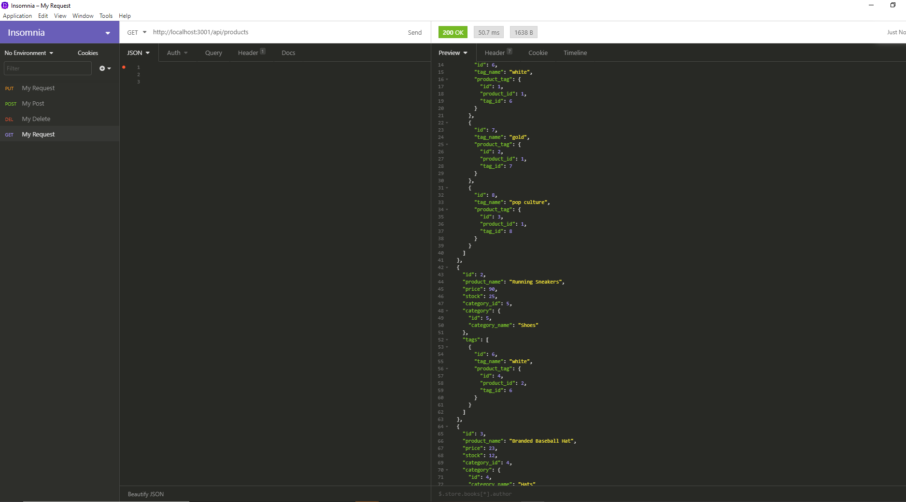

# E-commerce Back End Starter Code

## Table of Contents

* [Description](#Description)
* [Installation](#Installation)
* [Usage](#Usage)
* [License](#License)
* [Contributing](#Contributing)
* [Test](#Test)

## Description
This application is to setup a functional backend database which can be utilized to link a schema of products,categories, their tags and their product-tags. 

## Installation
First to ensure that the application will go to a database utilize the commands below in the terminal:

    mysql -u root -p

Enter your password and then make sure you have the database and tables in your system.

    use ecommerce_db;
    show tables;

Otherwise you will have to source the schema.sql file again to create the database from scratch,

    source db/schema.sql;

and seed all of your files from the terminal line

    npm run seed

Make sure all of these have gone through properly by checking your database and tables and ensure that the information has been filled

    mysql -u root -p
    use ecommerce_db;
    show tables;
    SELECT * FROM category;
    SELECT * FROM product; 
    SELECT * FROM tag; 
    SELECT * FROM product_tag;
    
The JSON file already contains dependencies to all modules required for this application (such as dotenv, mysql2, sequelize, and express) so to download them just use the command

    npm install

Once this is all finished just make a .env file with the information plugged in shown below to allow for privatized server information to be placed:

    DB_NAME='ecommerce_db'
    DB_USER='your username'
    DB_PW='your password'

## Usage
The application can be utilized using the insomnia application to send CRUD operations to the database which will alter the information stored there and also display each table schema.

To see a demonstration to the application run click on the two images below for PART 1 and PART 2

## License
MIT  

## Badges

## Contributing
For anyone who wishes to contribute you can contact me with the information below

## Test
The database was checked in the terminal via insomnia application utilizing CRUD operations for GET,POST,PUT and DELETE methods for each of the api routes and then each table was checked to ensure that the object was either created, updated or destroyed.

 
    
Would you like to reach us?
 
Contact Me:

Github: https://github.com/aznjp

Email: Jpark103193@gmail.com